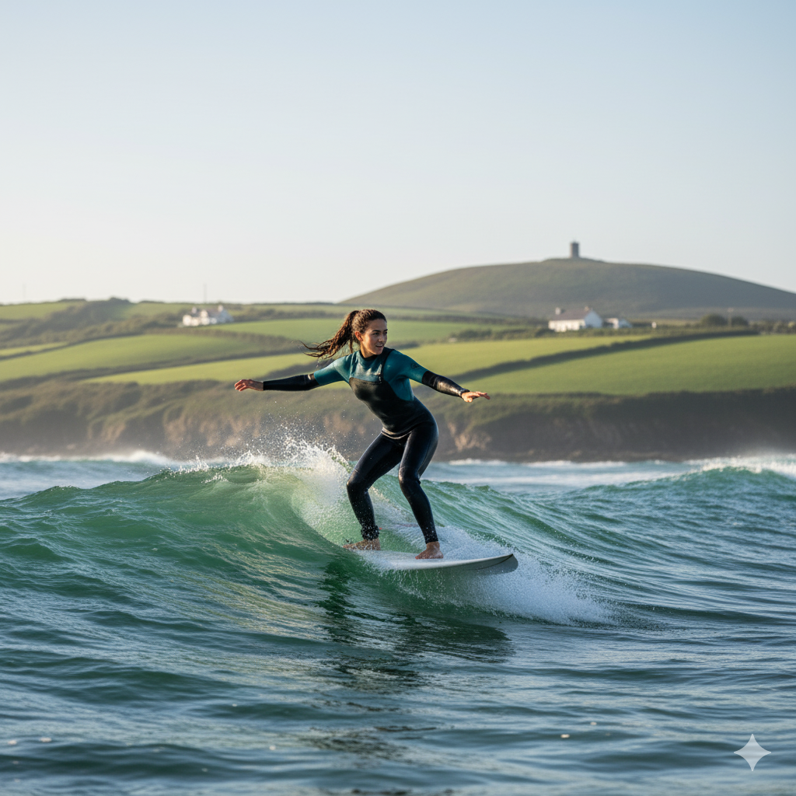

# West Cork Surf School – README

## Project Overview

The **West Cork Surf School** project is a responsive brochure-style website designed to promote surf lessons, SUP (stand-up paddle board) activities, and bookings in West Cork, Ireland.  
The site provides information about the school, its services, lesson options, FAQs, and a booking enquiry form. It is designed as part of the Code Institute Full Stack Bootcamp to demonstrate front-end development skills using **HTML, CSS, and Bootstrap**.

- **Live Site:**  
  [https://daswinkelmann.github.io/westcork-surf-school/](https://daswinkelmann.github.io/westcork-surf-school/)

- **Repository:**  
  [https://github.com/daswinkelmann/westcork-surf-school](https://github.com/daswinkelmann/westcork-surf-school)

---

## User Experience (UX)

### Site Owner Goals

- Promote West Cork Surf School as a trusted provider of surf lessons and activities  
- Encourage bookings through clear CTAs and a booking enquiry form  
- Provide reassurance about safety, equipment, and suitability for beginners

### User Stories

#### First-Time Visitors
- I want to understand what services the school offers  
- I want reassurance that lessons are safe and suitable for beginners  
- I want to easily find prices, services, and contact information

#### Returning Visitors
- I want to check lesson availability and make a booking  
- I want to find information about group or family discounts  
- I want to explore alternative activities like SUP

#### Frequent Visitors
- I want to see updates on lessons or seasonal offers  
- I want quick access to FAQs and contact information  
- I want to recommend the site to friends or family

---

## Design

### Wireframes

Wireframes were created for mobile, tablet, and desktop to ensure a responsive design.

#### Home Page Wireframes

| Mobile | Tablet | Laptop |
|--------|--------|--------|
|  |  |  |

#### Services Page Wireframes

| Mobile | Tablet | Laptop |
|--------|--------|--------|
|  |  |  |

#### Wireframe Schemas

| Main Schema | Services Schema |
|-------------|------------------|
|  |  |

---

## Responsiveness

**SurfsUp** is fully responsive across all screen sizes, thanks to **Bootstrap’s grid system**. The layout adapts smoothly from desktop to mobile, ensuring a clean and enjoyable experience whether users are booking surf lessons on their laptop or browsing on the beach from their phone.

---

## Colour Palette

The colour palette for **SurfsUp** was chosen to evoke feelings of **freshness, fun**, and the natural world of **surf, sea, sand, and sun**. The tones are light and vibrant, aiming to reflect the easy-going, welcoming vibe of coastal life while still ensuring clarity and accessibility.

The primary colours take inspiration directly from the ocean, offering a mix of calming blues and energising yellows. Special attention was given to contrast and visual harmony, ensuring combinations remain accessible and legible across devices.

| Colour Name       | Hex Code   | Description                                   |
|-------------------|------------|-----------------------------------------------|
| Navy Blue         | `#05445E`  | Represents the deep ocean and builds trust    |
| Blue Grotto       | `#189AB4`  | Suggests waves and a sense of freshness       |
| Baby Blue         | `#D4F1F4`  | Offers a clean, crisp, airy feel              |
| Amber             | `#F7CB2D`  | Adds a warm contrast like sunshine or sand    |
| Teal (Secondary)  | `#00B2A9`  | Used for accents and surf-inspired energy     |

---

## Typography

The **SurfsUp** project uses two free and widely accessible Google Fonts: **Orelega One** and **Inter**. These were selected to reflect the tone — fun, light, and modern — while ensuring readability and accessibility.

### Font Samples

| Inter A | Inter B | Orelega A | Orelega B |
|---------|---------|-----------|-----------|
|  |  |  |  |

---

## Imagery

The imagery in **SurfsUp** showcases the services at their best using photo-realistic AI-generated visuals from Google Gemini. These reflect the **natural beauty, energy, and excitement** of the surfing experience in West Cork. All images will be replaced with high-resolution professional photos in the final live site.

| Group Laughing | Girl with Wave | Group Lesson | Group Walking |
|----------------|----------------|--------------|----------------|
|  |  |  |  |

| Kids on Beach | Standup Man | Teen with Board | Adult Wave |
|---------------|-------------|------------------|------------|
|  |  |  |  |

---

## Features

### Existing Features

#### Home Page
- Hero section introducing the surf school  
- Image carousel  
- Clickable service cards  
- Footer with contact details and social links

#### Services & Booking Page
- Four service blocks: Adults, Kids, One-to-One, SUP  
- Booking enquiry form with validation  
- Collapsible FAQ section

#### Navigation
- Responsive nav bar (hamburger menu on mobile)  
- Links to Home, Services, Contact

#### Footer
- Contact info  
- Social media icons

### Final Screenshots

| Mobile | Tablet | Laptop |
|--------|--------|--------|
|  |  |  |

---

### Future Features

- Complete Services section  
- Integration with online booking system  
- Online payment options  
- Surf blog and seasonal updates  
- Dark mode toggle

---

## Testing

### Manual Testing

- Navigation works on all screen sizes  
- Forms tested for validation and correct input  
- Responsive display verified via Chrome DevTools  
- Carousel transitions smooth

---

## Validator Testing

| HTML Validation | CSS Validation |
|------------------|------------------|
|  |  |

---

## Lighthouse Testing

Tested in Chrome DevTools. Scores ranged between **90–100** in Performance, Accessibility, Best Practices, and SEO.

| Lighthouse Report |
|-------------------|
|  |

---

## Accessibility

- Colour contrast adheres to WCAG AA  
- Semantic HTML throughout  
- All images include alt text

---

## Known Issues

- Carousel images crop slightly on very narrow screens  
- Mobile nav doesn't auto-close after link click (Bootstrap default)

---

## Deployment

### GitHub Pages

1. Go to **Settings** in the repo  
2. Click **Pages**  
3. Set branch = `main`, folder = `/root`  
4. Save and wait for deployment  
5. Live site appears in the banner

- **Live Link:**  
  [https://daswinkelmann.github.io/westcork-surf-school](https://daswinkelmann.github.io/westcork-surf-school)

### Local Deployment

To clone the project locally:

```bash
git clone https://github.com/daswinkelmann/westcork-surf-school.git
```

Then open the folder in VS Code and run `index.html` in a browser.

---

## Credits

### Content
- All text written by me with help from ChatGPT

### Media
- Images: AI generated with Google Gemini  
- Icons: [Font Awesome](https://fontawesome.com)  
- Fonts: [Google Fonts](https://fonts.google.com)

### Code
- Navbar, footer, and form inspired by Code Institute’s *Love Running* and *Boardwalk Games* walkthroughs  
- Additional help from Bootstrap docs

---

## 📌 Future Development Notes

- Add testimonial carousel  
- Add seasonal pricing table with downloadable PDF  
- Add newsletter sign-up form

---

## 📑 Appendix A – User Stories with Acceptance Criteria

| User Story | Acceptance Criteria |
|------------|---------------------|
| As a first-time visitor, I want to understand what services the surf school offers so that I can decide if they suit me. | Services page clearly lists all lesson types (Adults, Kids, 1-to-1, SUP). Each has a short description and “Book Now” link. |
| As a first-time visitor, I want reassurance about safety and equipment so that I feel confident to try surfing. | FAQ section includes answers on safety, swimming ability, and equipment. Kids’ lessons described as safe and supervised. |
| As a first-time visitor, I want to quickly find contact details so that I can ask questions. | Contact info in footer. Booking form available on Services page. |
| As a returning visitor, I want to check lesson availability so that I can book my preferred time. | Booking form asks for preferred lesson type/date. Confirmation shown after submission. |
| As a returning visitor, I want to explore SUP so that I can try something new. | SUP lesson shown on Services page and included in booking options. |
| As a returning visitor, I want to know if group discounts are available. | Group discounts mentioned in Services or FAQ. Booking form accepts group enquiries. |
| As a frequent visitor, I want to see seasonal offers. | Future Features note a “special offers” section. Peak season mentioned (May–Sept). |
| As a frequent visitor, I want fast access to FAQs. | FAQ section is on the Services page, grouped by topic. |
| As a site owner, I want visitors to submit a booking enquiry. | Booking form includes Name, Email, Lesson Type. Success message shown after submit. |
| As a site owner, I want the site to be responsive. | Tested on multiple screen sizes. Bootstrap grid ensures responsiveness. |
